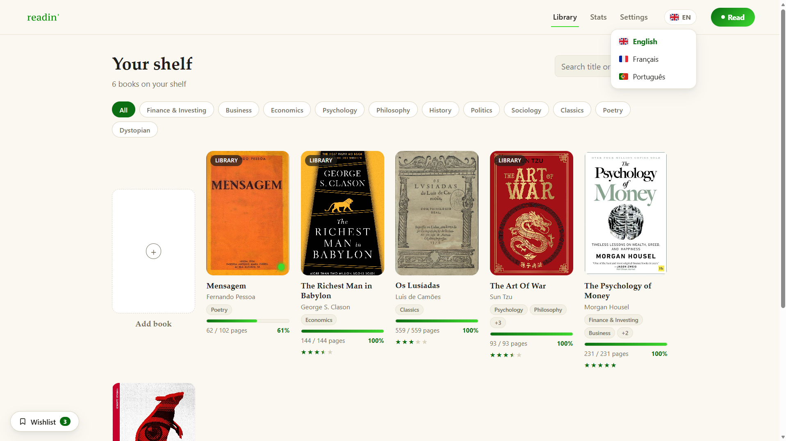

# readin'

A local-only, offline book & reading tracker. No install, no build step,
no account, no backend. You open `index.html` and the app writes real
files (a JSON database + cover images) to a `data/` folder next to it,
using your browser's File System Access API.

## Why it's built this way

1. Running it should be as close to "just open index.html" as possible:
   no `npm install`, no bundler, no framework.
2. Your data should be real files on disk, not hidden in browser storage:
   inspectable and backup-able with a simple copy-paste.

Writing real files from `file://` is only possible via the File System
Access API, which is why this currently only runs in Chromium browsers.

## Features

- **Library**: books with cover, author, pages, ownership, ISBN, and
  many-to-many categories (~43 sensible defaults included)
- **Reading logs**: log pages per session, with streak tracking, an
  activity heatmap, and stats (books finished, avg. pages/day, etc.)
- **Timed sessions**: countdown or stopwatch mode, log pages at the end
- **Star ratings**: half-star increments, once a book is finished
- **Wishlist**: a small corner widget for books not yet in your library
- **CSV export**: export your library as a spreadsheet-ready CSV
- **Multi-language**: English, European Portuguese, French
- **100% offline**: no external requests, no analytics, no CDN assets

## Requirements

Chrome or Edge (any recent version). The File System Access API only
ships in Chromium browsers. Brave works too, behind a flag:
`brave://flags/#file-system-access-api`. Firefox and Safari aren't
supported.

## Getting started

1. Download or clone this repository.
2. Open `index.html` in Chrome or Edge.
3. Click **"Choose the readin' folder"** and select the project folder.
4. Done: `data/` and `data/covers/` are created automatically.

## Where your data lives

Plain JSON + images under `data/`: `library.json` (books/categories),
`logs.json`, `reads.json`, `ratings.json`, `wishlist.json`, and
`covers/`. All real files, nothing hidden in browser storage.

## Tech stack

Vanilla HTML/CSS/JS. No frameworks, no build tools, no backend. Scripts
are classic `<script src>` (not ES modules), since `file://` pages
block module fetches in Chromium.

## License

Licensed under the [PolyForm Noncommercial License 1.0.0](https://polyformproject.org/licenses/noncommercial/1.0.0/).
Free to use, modify, and share for any noncommercial purpose. Commercial
use requires permission from the author. Full text in [LICENSE](LICENSE).

## Contributing

Issues and PRs welcome. This is a personal project built around a
specific set of opinions (see above). Please open an issue to discuss
larger changes before sending a PR.
